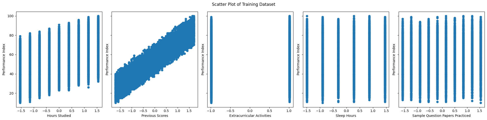
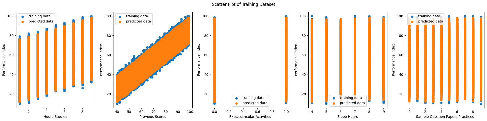

# Multiple Linear Regression from Scratch

## Overview

This project implements **multiple linear regression from scratch** using gradient descent optimization and feature normalization. The implementation predicts student performance based on multiple features without relying on external ML libraries like scikit-learn.

## Dataset

- **Source**: Student_Performance.csv
- **Features**:
  - Hours Studied
  - Previous Scores
  - Extracurricular Activities (Yes/No → 1/0)
  - Sleep Hours
  - Sample Question Papers Practiced
- **Target**: Performance Index
- **Size**: 10,000 samples

### Training Dataset Visualization

The scatter plots above show the relationship between each feature and the target performance index. Each subplot displays one feature on the x-axis and performance index on the y-axis, revealing the linear relationships the model learns.

## Algorithm Overview

### 1. **Linear Model**

$$f(\mathbf{x}) = \mathbf{w}^T \mathbf{x} + b$$

Where:

- $\mathbf{w}$ = weight vector (n features)
- $\mathbf{x}$ = feature vector
- $b$ = bias term

### 2. **Cost Function** (Mean Squared Error)

$$J = \frac{1}{2m} \sum_{i=1}^{m} (f_{\mathbf{w},b}(\mathbf{x}^{(i)}) - y^{(i)})^2$$

### 3. **Gradients**

$$\frac{\partial J}{\partial \mathbf{w}} = \frac{1}{m} \sum_{i=1}^{m} (f_{\mathbf{w},b}(\mathbf{x}^{(i)}) - y^{(i)}) \mathbf{x}^{(i)}$$

$$\frac{\partial J}{\partial b} = \frac{1}{m} \sum_{i=1}^{m} (f_{\mathbf{w},b}(\mathbf{x}^{(i)}) - y^{(i)})$$

### 4. **Gradient Descent Update**

$$\mathbf{w} := \mathbf{w} - \alpha \frac{\partial J}{\partial \mathbf{w}}$$
$$b := b - \alpha \frac{\partial J}{\partial b}$$

Where $\alpha$ = learning rate

## Training Details

- **Learning Rate (α)**: 0.001
- **Iterations**: 10,000
- **Feature Normalization**: StandardScaler (mean=0, std=1)
- **Initialization**: Weights = zeros, Bias = 0

## Implementation Details

- **Language**: Python 3
- **Core Dependencies**: NumPy, Pandas, Matplotlib
- **External ML Libraries**: None (algorithm built from scratch)

## Model Output

The training process outputs:

- **Final Weights** ($\mathbf{w}$): Coefficients for each feature
- **Final Bias** ($b$): Intercept term
- **Cost History**: Tracks MSE reduction across iterations
- **Predictions**: Model predictions for all training samples

## Visualizations

1. **Training Data Scatter Plots**: Shows relationship between each feature and target
2. **Cost Convergence Plot**: Displays how loss decreases during training
3. **Predictions vs Actual**: Overlay of predicted vs true performance values
## Results

The model learns optimal parameters (w, b) through iterative gradient descent, minimizing the cost function. The final trained model creates a linear regression line that best fits the relationship between years of experience and salary.

### Model Output

